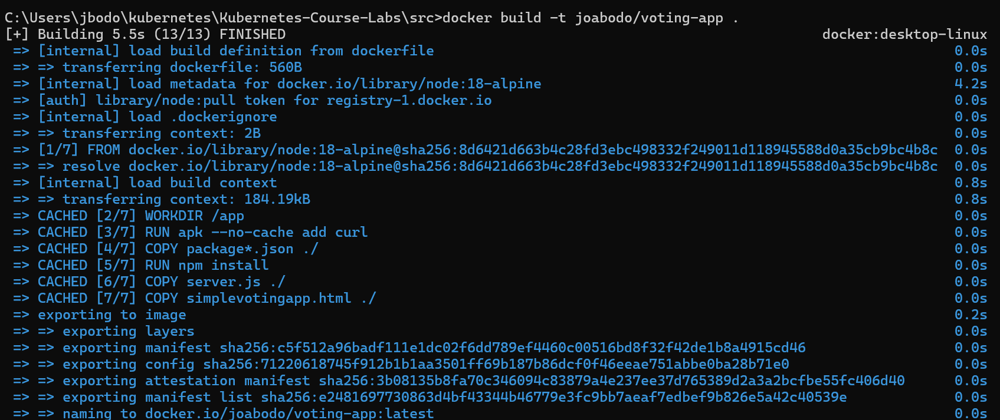

# Kubernetes-Course-Labs

# Kubernetes Voting App

A simple web-based voting application built with Node.js and Express, deployed in Kubernetes as part of the [Kubernetes Course Labs](https://kubernetes.courselabs.co/hackathon/). This project covers containerization, deployment, observability, logging, and CI/CD pipelines using Helm, Prometheus, Grafana, Fluent Bit, Elasticsearch, Kibana, Jenkins, and GitHub.

---

## Table of Contents

* [Overview](#overview)
* [Architecture](#architecture)
* [Installation](#installation)
* [Usage](#usage)
* [Observability](#observability)
* [Centralized Logging](#centralized-logging)
* [CI/CD Pipeline](#cicd-pipeline)
* [Testing](#testing)
* [Dependencies](#dependencies)

---

## Overview

This app allows users to vote for Kubernetes-related technologies: Kubernetes, Docker, Helm, and Prometheus. It demonstrates how to:

* Containerize a Node.js app
* Deploy it to Kubernetes using Helm
* Add observability with Prometheus and Grafana
* Implement centralized logging with the EFK stack
* Create a full CI/CD pipeline with Jenkins and Gogs

---

## Architecture

```
User --> Ingress --> Web Server --> API Endpoints --> In-Memory Store
                                 |-> /api/vote
                                 |-> /api/votes
```

---

## Installation

### Prerequisites

* Docker
* Minikube or a Kubernetes cluster
* kubectl
* Helm

### Local Run

```bash
npm install
node server.js
```

Then open [http://localhost:8080](http://localhost:8080)

### Kubernetes Deployment

```bash
helm install voting-app ./helm/voting-app --namespace vote
```


To access the app:

```bash
kubectl port-forward svc/voting-app-service 8080:80 -n vote
```

Then visit [http://localhost:8080](http://localhost:8080)

---

## Usage

Once deployed:

* Visit the app in your browser
* Click on a vote option
* API will record it via `/api/vote`
* Tally available via `/api/votes`

---

## Observability

The app publishes metrics on a `/metrics` endpoint.

### Steps:

* Deploy Prometheus Operator
* Apply a `ServiceMonitor` to scrape your app’s metrics
* Deploy Grafana
* Load `grafana-dashboard.json`

```bash
kubectl apply -f monitoring/servicemonitor.yaml
```

Access Grafana:

```bash
kubectl port-forward svc/prometheus-stack-grafana 3000:80 -n monitoring
```

Login with:

* User: admin
* Password: prom-operator default

---

## Centralized Logging

The app logs to `/logs/app.log`. To centralize logs:

* Use Fluent Bit as a DaemonSet
* Sidecar container tailing `/logs/app.log`
* Deploy Elasticsearch & Kibana

Load `kibana-dashboard.ndjson` to see logs

---

## CI/CD Pipeline

Implemented with Jenkins, Gogs, and BuildKit.

### Steps:

1. Build Docker images
2. Push to Docker Hub
3. Deploy using Helm with `smoke-test.yaml`

Trigger the pipeline from a Gogs push:

```bash
git remote add gogs http://<gogs-url>/<user>/Kubernetes-Course-Labs.git
git push gogs main
```

Ensure `Jenkinsfile` is correctly set up.

---

## Testing

Install Mocha:

```bash
npm install --save-dev mocha chai
```

Run tests:

```bash
npm test
```

Test files are in the `/test` directory. They cover:

* GET `/api/votes`
* POST `/api/vote`

---

## Dependencies

* Node.js
* Express.js
* Kubernetes
* Helm
* Prometheus + Grafana
* Fluent Bit + Elasticsearch + Kibana
* Jenkins + BuildKit + Gogs

